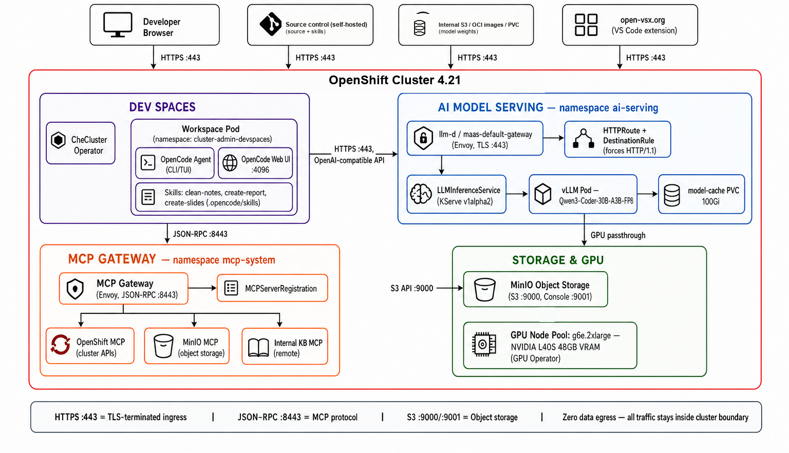
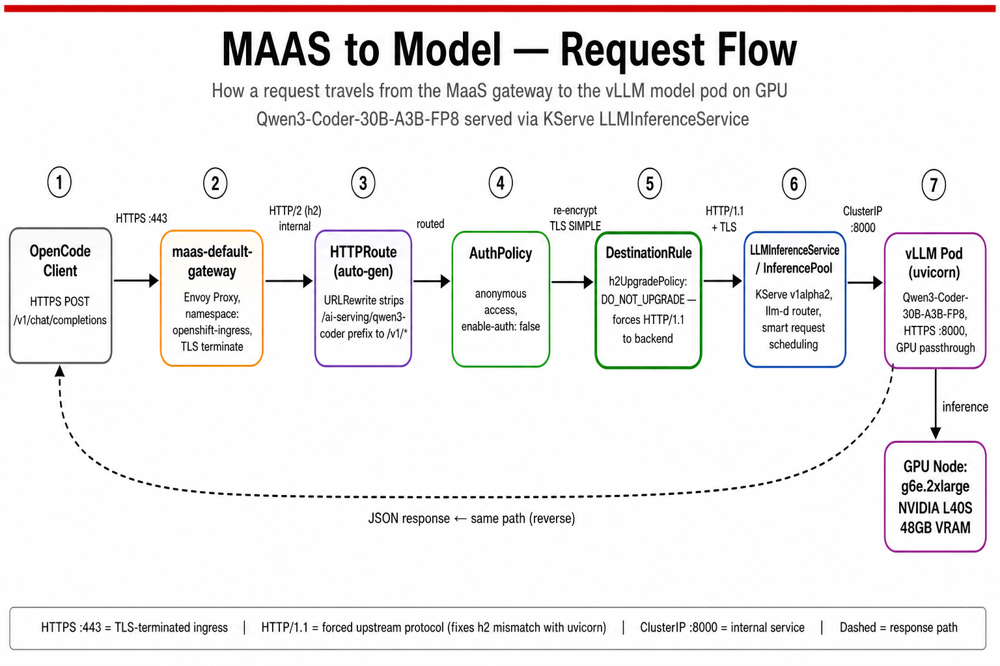

# Synapxe OpenCode — Private AI on OpenShift

Replication guide for the infra we stood up: **Dev Spaces + OpenCode**, **MaaS / llm-d model serving**, and **MCP gateway + MCP servers**, all on Red Hat OpenShift with zero public-model egress for inference.

## Architecture

Request path (blue box, hop by hop):

## What this stack does

| Layer | Role |
|-------|------|
| OpenShift Dev Spaces | Browser IDE from git (`devfile.yaml`) |
| OpenCode | Coding agent UI/CLI, talks OpenAI-compatible API + MCP |
| MaaS gateway | Single front door for model traffic (Envoy) |
| llm-d / KServe | Routes and schedules into vLLM |
| vLLM + GPU | Runs the open-weight model (Qwen3-Coder) |
| MCP gateway | Single front door for tools (JSON-RPC) |
| MCP servers | MinIO (and others) registered via `MCPServerRegistration` |

## Recommended install order

Follow these docs in order when rebuilding on a fresh cluster:

1. [Prerequisites and operators](docs/01-prerequisites.md)
2. [Configure MaaS](docs/02-maas.md)
3. [Configure llm-d / model serving](docs/03-llmd-model-serving.md)
4. [MCP gateway full flow](docs/04-mcp-gateway.md)
5. [MCP server full flow](docs/05-mcp-server.md)
6. [Bake OpenCode into Dev Spaces](docs/06-devspaces-opencode.md)
7. [Verification commands](docs/07-verification.md)
8. [Disconnected / air-gapped notes](docs/08-disconnected.md)

## Repo contents that matter for replication

| Path | Purpose |
|------|---------|
| `devfile.yaml` | Dev Spaces workspace recipe (image, env, writes `opencode.json`, starts web UI) |
| `Dockerfile.opencode` | Custom UDI image with OpenCode + python-pptx/docx |
| `llminferenceservice.yaml` | KServe `LLMInferenceService` for Qwen on MaaS gateway |
| `.opencode/skills/` | Git-persisted agent skills (`clean-notes`, `create-report`, `create-slides`) |
| `AGENTS.md` | Shared agent instructions for the project |
| `diagrams/` | Architecture and request-flow diagrams |
| `docs/` | Step-by-step infra runbooks |

## Reference cluster shape (lab)

Names below match the lab we used; replace hostnames/namespaces for your environment.

- Cluster API: `api.<cluster>.openshiftapps.com`
- Model namespace: `ai-serving`
- MaaS gateway: `maas-default-gateway` in `openshift-ingress`
- MCP gateway: `mcp-gateway` in `gateway-system`
- MCP registrations: e.g. `minio-mcp` in `minio`
- Dev Spaces workspace NS: `cluster-admin-devspaces` (per user / team)
- Git: https://github.com/nirjhar17/synapxe-opencode-demo.git

## Important distinction

- **MaaS path** = inference (`/v1/chat/completions`) — thinking
- **MCP path** = tools (JSON-RPC `tools/list`, `tools/call`) — acting

They are separate gateways on purpose.

## Disclaimer

Views and setup notes are for educational / lab replication. Validate CRD API versions with `oc explain` on your cluster before applying YAML — RHOAI and Kuadrant versions move the schema.
